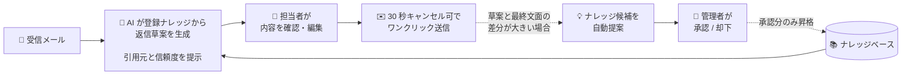
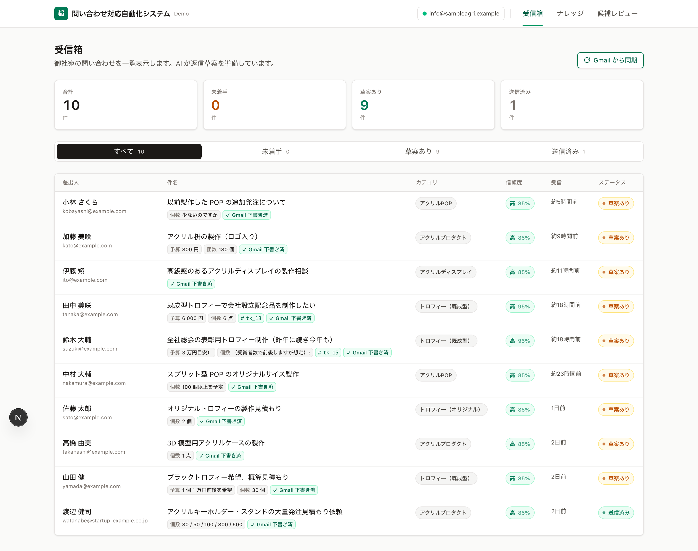
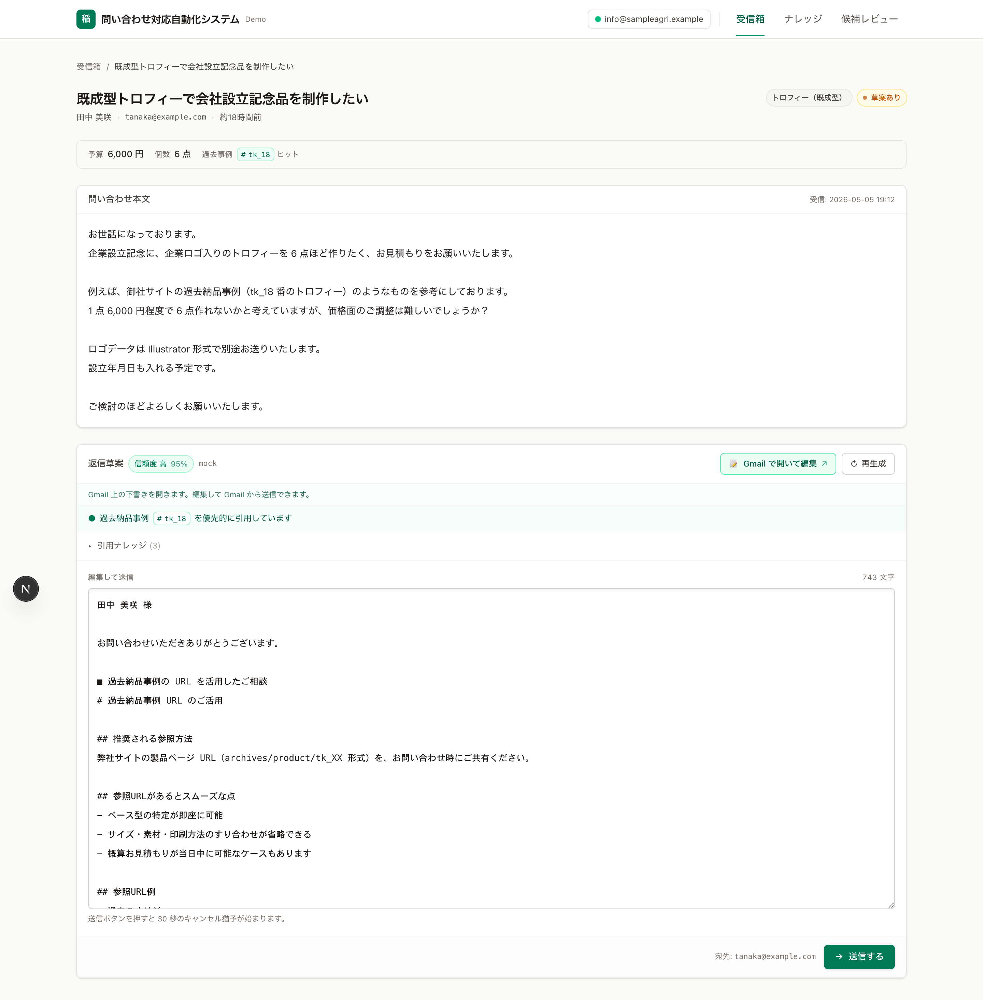
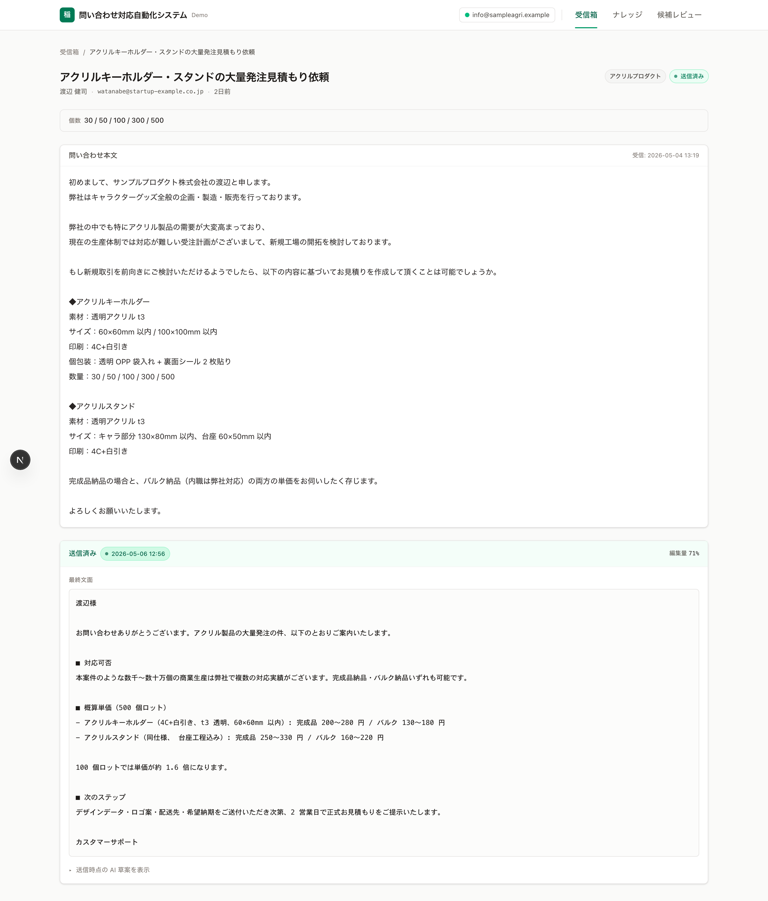
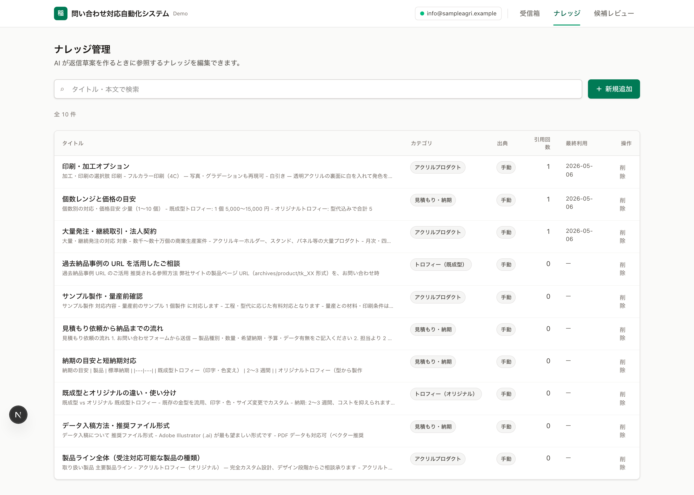
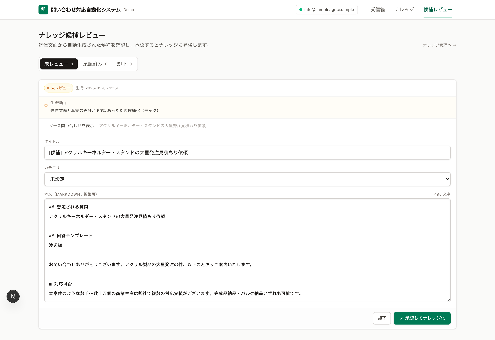

# 問い合わせ対応自動化システム — システム概要

> **メール問い合わせ業務の対応工数を大幅に削減しながら、最終判断は必ず担当者の手元に残します。**
> AI が返信草案を自動生成し、担当者は内容を確認してワンクリックで送信。日々の対応内容からナレッジが継続的にアップデートされていく仕組みです。

---

## 解決する課題

- **問い合わせ対応の業務負荷の増大**：1 件ごとに過去メールの確認、類似案件の検索、テンプレートの編集といった作業が発生し、経験豊富な担当者に業務が集中する傾向があります。
- **回答品質の属人化**：担当者によって回答内容が異なる、もしくは古い情報のまま返信されるといった事象が発生しやすく、「過去にどのように回答したか」を組織として蓄積する仕組みが整備されていない状況がございます。
- **ナレッジ整備の継続性の課題**：FAQ や対応マニュアルは作成後の更新が滞りやすく、日々の問い合わせ内容を起点に継続的に拡充されていく仕組みが求められています。

---

## システムの全体像

担当者の操作は **「メールを開く → 草案を確認・編集 → 送信」の 3 ステップ** に集約されます。
裏側では AI が登録ナレッジから返信草案を構築し、送信されたやり取りを解析してナレッジを継続的に拡充するループが稼働します。

- **送信は必ず担当者の判断を経由します。** 担当者の確認を経ずに自動送信されることはございません。
- **ナレッジの更新にも管理者の承認を必須とします。** 自動提案された候補は、管理者が内容を確認・承認した上で正式なナレッジに反映されます。
- **AI 出力の根拠を常に提示します。** 草案には「引用したナレッジ」と「AI 自己評価の信頼度（高 / 中 / 低）」が必ず添えられ、誤情報の混入リスクを最小化する設計としています。

### システムを構成する 4 つの画面

| 画面 | 役割 | 主な利用者 |
|---|---|---|
| **受信箱** | 問い合わせ全体を一覧把握し、信頼度に応じて優先順位を判断 | 担当者 |
| **詳細・草案編集** | AI 草案の確認・編集、30 秒キャンセル機能付き送信 | 担当者 |
| **ナレッジ管理** | FAQ の一元管理、引用回数による陳腐化の可視化 | 管理者 |
| **候補レビュー** | 自動提案されたナレッジ候補の承認・却下 | 管理者 |

---

## 受信箱

受信した問い合わせを **未着手 / 草案あり / 送信済み** の 3 ステータスで一覧表示します。
カテゴリ（商品・配送・ふるさと納税・クレーム・採用など）はカラーバッジで分類され、各問い合わせには **AI 草案の信頼度** が併記されます。
担当者は信頼度を参照しながら、運用方針に応じた優先順位で対応いただけます（信頼度の高いものから効率重視で進める運用、低いものから着手しリスク対応を優先する運用、いずれの方針にも対応可能です）。

---

## 主な機能

### 1. 問い合わせ受信時に AI が返信草案を自動生成

メール受信と同時に AI が登録ナレッジを参照し、返信草案を自動で構築します。担当者が受信箱を開いた時点で、全件に草案が用意されている状態となります。
草案には **引用したナレッジ** と **AI 自己評価の信頼度（高 / 中 / 低）** が必ず併記され、根拠の確認を経ずに送信することはできない設計です。
草案はテキストエリアで自由に編集が可能で、大幅な修正が必要な場合は「再生成」機能により再構築いただけます。

### 2. 30 秒のキャンセル機能を備えたワンクリック送信

送信ボタン押下後に **30 秒のカウントダウン** が開始され、その間はいつでもキャンセル操作が可能です。誤送信のリスクを最小化する仕組みとなっています。
送信完了後の画面では、AI 草案と実際に送信した最終文面の **差分率** を自動算出し、後述のナレッジ自動更新における判定指標として活用されます。

### 3. ナレッジ管理機能

商品情報・配送条件・各種制度・採用情報など、すべての FAQ を Markdown 形式で一元管理いただけます。
各ナレッジには **引用回数** と **最終利用日時** が自動的に記録され、活用頻度が低下しているナレッジを把握しやすい構成となっています。
新規追加・編集・削除はモーダル画面から即時反映され、以降の AI 草案生成にも自動的に反映されます。

### 4. 問い合わせ内容から新規ナレッジ候補を自動提案

担当者が AI 草案を **大幅に書き換えて送信** したケースを検知し、その編集差分を AI が解析、新規ナレッジとして追加すべき情報を候補として自動提案します。
**ナレッジの品質維持の観点から、候補が直接ナレッジに反映されることはございません。** 候補レビュー画面で管理者が内容を確認・承認した場合に限り、正式なナレッジとして登録されます。
候補は「保留中 / 承認済み / 却下済み」の 3 ステータスで進捗管理いただけます。
