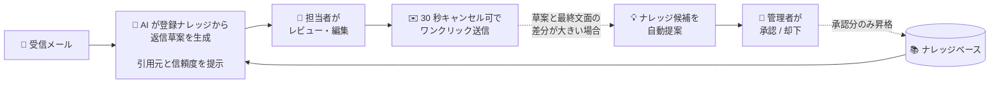

# 問い合わせ対応自動化システム — システム概要

> **問い合わせメール対応を、人間の判断を残したまま 5 分の 1 に圧縮する。**
> AI が下書き、人がワンクリックで送信。送ったやり取りからナレッジが自動で育つ。

---

## 解決する課題

- **問い合わせ対応に時間が溶ける**：1件ごとに過去メールを掘り、似た案件の返信を探し、テンプレを切り貼り。慣れた担当ほど属人化する。
- **答えの揺れと、抜け漏れ**：人によって回答が違う／古い情報のまま返してしまう。「前にどう答えたか」が組織に残らない。
- **ナレッジが追いつかない**：FAQ や対応マニュアルは、書いた瞬間から古くなる。実際の問い合わせから自動で育つ仕組みが要る。

---

## システムの全体像

担当者の手元では **「メールを開く → 草案を整える → 送信」の 3 アクションだけ**。
裏側では AI が登録ナレッジから草案を組み立て、送信内容を解析してナレッジを育てるループが回り続けます。

- **完全自動送信はしません。** 最終の「送るか送らないか」は必ず人間の手元で判断します。
- **ナレッジの自動更新もしません。** 候補は提案するだけで、反映には人間の承認が必須です。
- **AI が嘘をつかない仕組み**：草案には必ず「どのナレッジを引用したか」と「信頼度（高 / 中 / 低）」が添えられ、根拠の裏取りなしに送れない設計です。

### システムを構成する 4 つの画面

| 画面 | 役割 | 主な利用者 |
|---|---|---|
| **受信箱** | 問い合わせを一覧で把握、信頼度の高い順に処理 | 担当者 |
| **詳細・草案編集** | AI 草案をレビューして送信、誤送信は 30 秒以内に取消 | 担当者 |
| **ナレッジ管理** | FAQ を Markdown で一元管理、引用回数で陳腐化を検出 | 管理者 |
| **候補レビュー** | 自動生成されたナレッジ候補を承認 / 却下 | 管理者 |

---

## 受信箱

サンプル農園宛の問い合わせを **未着手 / 草案あり / 送信済み** の 3 ステータスでひと目に。
カテゴリ（商品・配送・ふるさと納税・クレーム・採用 など）を色付きバッジで分類し、各メールに **AI 草案の信頼度** がそのまま並びます。
担当者は信頼度の高いものから順に処理できる構成です。

---

## 主な機能

### 1. 受信メールから AI が返信草案を即座に生成

メールが**届いた瞬間に** Claude が登録ナレッジから関連情報を引き、返信文を自動で組み立てます。担当者が受信箱を開いた時点で、すでに全件に草案が用意されている状態です。
草案には **どのナレッジを引用したか** と **AI 自己評価の信頼度（高 / 中 / 低）** が必ず添えられ、根拠の裏取りなしに送ることはできません。
そのままテキストエリアで自由に編集でき、気に入らなければ「再生成」ボタンで何度でもやり直せます。

### 2. 30 秒のキャンセル可能な「ワンクリック送信」

送信ボタンを押すと **30 秒のカウントダウン** が始まります。誤送信に気づいたらいつでもキャンセル可。
送信後の画面では、AI 草案と人間が実際に送った最終文面の **差分率（diffRatio）** を自動算出し、後述のナレッジ自動更新の判定材料に使います。

### 3. ナレッジ管理（FAQ）

商品ライン・配送条件・ふるさと納税の納期・採用情報といった全 FAQ を Markdown で一元管理。
各ナレッジには **何回引用されたか / 最後に使われたのはいつか** が自動記録され、古びたナレッジを発見しやすくしています。
新規追加・編集・削除はモーダルから即時反映、AI 草案にも次回からそのまま反映されます。

### 4. 問い合わせから自動でナレッジ候補を提案

人間が AI 草案を **大きく書き換えて送信** したケースを検知すると、その編集差分を解析して「これは新しいナレッジにすべきでは？」と候補を自動生成します。
**毒入り学習を防ぐため、自動でナレッジに反映させることはしません。** 必ず候補レビュー画面で人間が承認 / 却下を判断し、承認したものだけが正式 FAQ に昇格します。
保留中・承認済み・却下済みの 3 タブで進捗管理できます。
