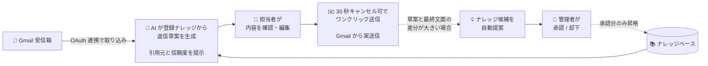

# 問い合わせ対応自動化システム — システム概要

> **メール問い合わせ業務の対応工数を大幅に削減しながら、最終判断は必ず担当者の手元に残します。**
> AI が返信草案を自動生成し、担当者は内容を確認してワンクリックで送信。日々の対応内容からナレッジが継続的にアップデートされていく仕組みです。

---

## 解決する課題

- **問い合わせ対応の業務負荷の増大**：1 件ごとに過去メールの確認、類似案件の検索、テンプレートの編集といった作業が発生し、経験豊富な担当者に業務が集中する傾向があります。
- **回答品質の属人化**：担当者によって回答内容が異なる、もしくは古い情報のまま返信されるといった事象が発生しやすく、「過去にどのように回答したか」を組織として蓄積する仕組みが整備されていない状況がございます。
- **ナレッジ整備の継続性の課題**：FAQ や対応マニュアルは作成後の更新が滞りやすく、日々の問い合わせ内容を起点に継続的に拡充されていく仕組みが求められています。

---

## システムの全体像

担当者の操作は **「メールを開く → 草案を確認・編集 → 送信」の 3 ステップ** に集約されます。
裏側では AI が登録ナレッジから返信草案を構築し、送信されたやり取りを解析してナレッジを継続的に拡充するループが稼働します。

- **Gmail と直接連携します。** OAuth 認証を一度行うだけで、受信箱の取り込みと返信の送信が御社の Gmail アカウント上で完結します。
- **送信は必ず担当者の判断を経由します。** 担当者の確認を経ずに自動送信されることはございません。
- **ナレッジの更新にも管理者の承認を必須とします。** 自動提案された候補は、管理者が内容を確認・承認した上で正式なナレッジに反映されます。
- **AI 出力の根拠を常に提示します。** 草案には「引用したナレッジ」と「AI 自己評価の信頼度（高 / 中 / 低）」が必ず添えられ、誤情報の混入リスクを最小化する設計としています。

### システムを構成する 4 つの画面

| 画面 | 役割 | 主な利用者 |
|---|---|---|
| **受信箱** | 問い合わせ全体を一覧把握し、信頼度に応じて優先順位を判断 | 担当者 |
| **詳細・草案編集** | AI 草案の確認・編集、30 秒キャンセル機能付き送信 | 担当者 |
| **ナレッジ管理** | FAQ の一元管理、引用回数による陳腐化の可視化 | 管理者 |
| **候補レビュー** | 自動提案されたナレッジ候補の承認・却下 | 管理者 |

---

## 受信箱（概要画面）

朝、受信箱を開いた時点で **すべての問い合わせに対して、AI が以下を完了した状態** になっています。

- **カテゴリの自動分類** — 件名と本文から「トロフィー（オリジナル/既成型）/ アクリルプロダクト / POP / ディスプレイ」などへ自動的に振り分け
- **予算・個数の自動抽出** — 本文中に「予算 1 万円前後」「個数 30 個」といった記載があれば、一覧画面に小さなピルで表示
- **過去納品事例 URL（型番）の検出** — 本文に「`tk_18`」のような過去事例 URL が含まれていれば、ピルで強調表示
- **返信草案の自動生成** — 引用ナレッジと信頼度（高 / 中 / 低）付きで提示

担当者は受信箱を一目見るだけで、案件の規模感（予算・個数）と AI の自信度を把握でき、「どの案件から手を付けるか」を判断いただけます。

---

## 担当者ができること

問い合わせを受信してから返信するまでの一連の流れを、すべてこの一画面で完結いただけます。

### ① 受信箱を開いて優先順位を判断する

朝、システムにログインすると、すべての新着問い合わせに **すでに AI 草案が用意されている** 状態です。
信頼度バッジを参考に、「迷わず送れそうな案件をまず片付ける」「難しそうな案件から着手する」など、運用方針に応じた優先順位で対応いただけます。

ヘッダーに表示される **「Gmail から同期」ボタン** を押すと、御社の Gmail 受信箱から最新メールを取り込み、自動で分類・草案生成まで完了します。

### ② 問い合わせを開いて AI 草案を確認する

問い合わせをクリックすると、原文の隣に **AI が登録ナレッジを根拠として組み立てた返信草案** が表示されます。
草案には **引用したナレッジ** と **信頼度** が必ず併記されているため、担当者は AI が何を参照して書いたかを即座に確認いただけます。

問い合わせ本文に **過去納品事例 URL（`tk_18` 等の型番）** が含まれている場合、その事例に紐づく社内ナレッジが自動的に優先引用されます。「過去納品事例 tk_18 を優先的に引用しています」というバナーで明示され、過去案件の仕様・価格をベースとした回答が即座に組み立てられる仕組みです。

### ③ 必要な部分だけ編集して送信する

草案はそのまま送ることも、テキストエリアで自由に編集することも可能です。
編集が大きく必要だと感じた場合は、「再生成」機能で別の草案を取得することもできます。
編集を終えたら **送信ボタン** を押すだけ。30 秒のカウントダウンが開始され、その間はいつでもキャンセル可能ですので、誤送信のご心配はございません。

### ④ 送信済みの履歴と差分を確認する

送信完了後の画面では、AI が組み立てた草案と、担当者が実際に送信した最終文面の **差分率** が自動的に算出されます。
過去に「どのような問い合わせに、どう返信したか」をいつでも振り返ることができ、新人担当者の研修資料としてもご活用いただけます。

---

## 管理者ができること

ナレッジの整備と AI 品質の管理は、管理者向けの 2 画面で行います。

### ナレッジベースの管理

商品ライン・価格・納期・データ入稿方法・採用情報など、すべての FAQ を Markdown 形式で一元管理いただけます。
各ナレッジには以下の情報が自動的に記録されます。

- **引用回数** — そのナレッジが過去に何回 AI 草案で参照されたか
- **最終利用日時** — 直近で使われたのはいつか
- **出典区分** — 管理者が手で登録したもの／AI 提案から昇格したもの

引用回数が低いナレッジは陳腐化している可能性があるため、定期的な見直しの目印としてご活用いただけます。

### 自動生成されたナレッジ候補のレビュー

担当者が AI 草案を **大幅に書き換えて送信** したケースを検知すると、AI が編集差分を解析し「新規ナレッジとして追加すべき情報」を候補として自動提案します。
管理者は候補レビュー画面で、以下のいずれかを判断いただけます。

- **承認**: 内容を必要に応じて編集した上で、正式な FAQ として登録
- **却下**: ナレッジ化が不要と判断した場合に却下（履歴は残ります）

候補は「保留中 / 承認済み / 却下済み」の 3 ステータスで進捗管理でき、管理者が承認した内容のみが正式ナレッジに昇格する設計です。
ナレッジの品質維持の観点から、自動的にナレッジに反映されることはございません。
